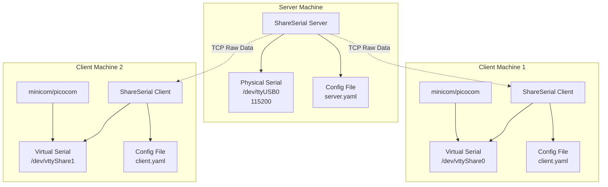
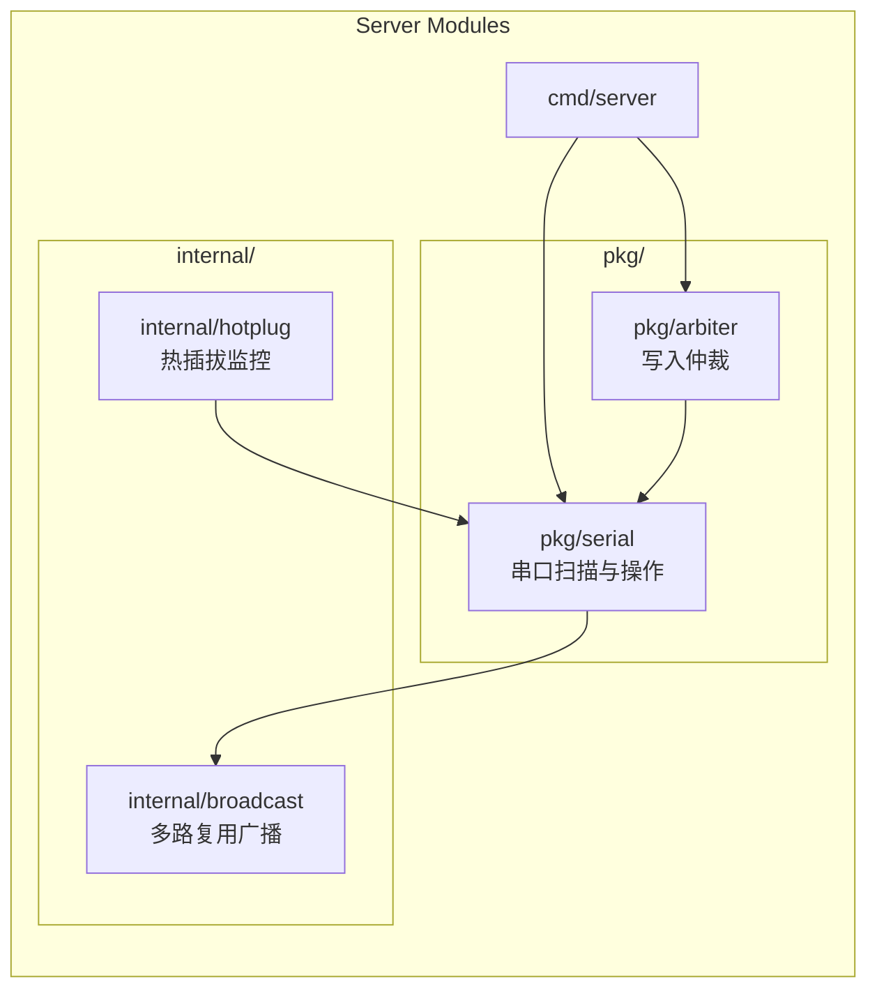
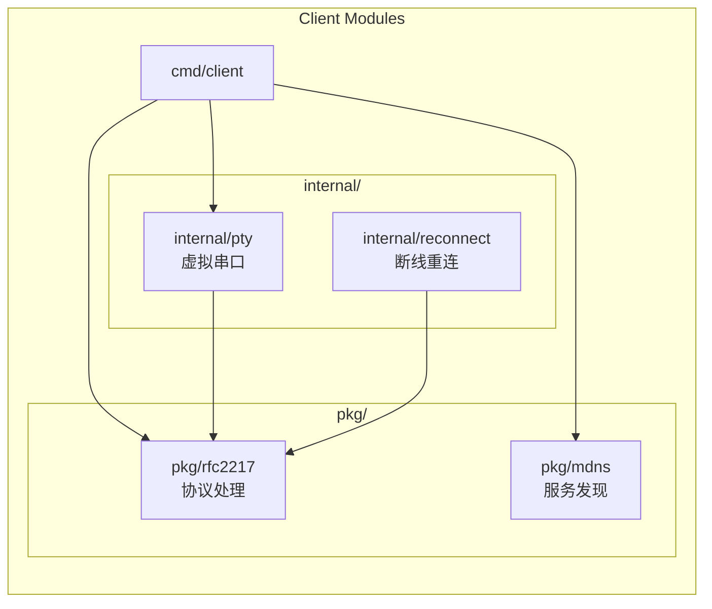
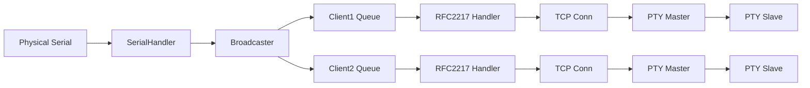
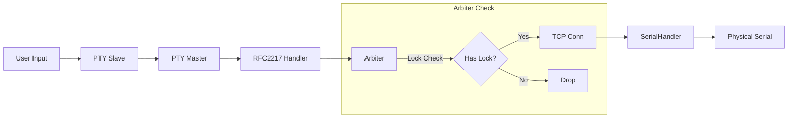

# ARCHITECTURE.md - 系统架构

## 1. 整体架构图（简化版）



## 2. 服务端架构

### 2.1 模块划分（简化版）



**已删除模块：**
- ~~pkg/rfc2217~~ → 简化为纯数据转发
- ~~pkg/mdns~~ → 使用配置文件

### 2.2 服务端核心结构

```go
type Server struct {
    config     *Config
    serials    map[string]*SerialHandler  // 串口名称 -> 处理器
    clients    map[string]*ClientConn     // 客户端 ID -> 连接
    arbiter    *Arbiter                    // 写入仲裁器
    mdns       *MDNSService                // mDNS 服务
    hotplug    *HotplugMonitor             // 热插拔监控
    broadcast  *Broadcaster                // 数据广播器
    
    ctx        context.Context
    cancel     context.CancelFunc
    wg         sync.WaitGroup
}

type SerialHandler struct {
    name       string           // /dev/ttyUSB0
    port       *serial.Port     // 物理串口
    config     *SerialConfig    // 当前配置
    clients    map[*Client]bool // 已连接客户端
}

type ClientConn struct {
    id         string
    conn       net.Conn
    rfcHandler *RFC2217Handler
    serial     string          // 连接的串口名
    hasLock    bool            // 是否持有写锁
}
```

## 3. 客户端架构

### 3.1 模块划分



### 3.2 客户端核心结构

```go
type Client struct {
    config     *Config
    conn       net.Conn            // TCP 连接
    rfcHandler *RFC2217Handler     // RFC2217 处理器
    pty        *PTYDevice          // 虚拟串口
    mdns       *MDNSClient         // mDNS 客户端
    
    reconnect  *ReconnectManager   // 重连管理
    state      ClientState         // 当前状态
    
    ctx        context.Context
    cancel     context.CancelFunc
}

type PTYDevice struct {
    master     *os.File            // PTY master
    slave      *os.File            // PTY slave
    slavePath  string              // /dev/pts/X
    symlink    string              // /dev/vttyShare0
}
```

## 4. 数据流架构

### 4.1 读取数据流（下行）



### 4.2 写入数据流（上行）



## 5. 关键设计决策

### 5.1 为什么用 RFC2217？

| 方案 | 优点 | 缺点 |
|------|------|------|
| RFC2217 | 标准、兼容现有工具、有现成客户端 | 协议复杂 |
| 自定义 TCP | 简单、性能可控 | 不兼容现有工具 |
| WebSocket | Web 支持 | 串口工具不支持 |

**决策：RFC2217**
- 兼容 telnet-based 串口客户端（如 ser2net）
- 支持远程波特率配置

### 5.2 为什么用 PTY 而不是 CUSE？

| 方案 | 优点 | 缺点 |
|------|------|------|
| PTY | 简单、无需内核驱动 | 设备名不可自定义 |
| CUSE | 可自定义设备名 | 需要 FUSE、复杂 |

**决策：PTY + symlink**
- PTY 创建简单，稳定
- 创建 symlink `/dev/vttyShare0` -> `/dev/pts/X`

### 5.3 写入仲裁为什么选独占模式？

| 方案 | 优点 | 缺点 |
|------|------|------|
| 独占模式 | 简单、安全 | 串口利用率低 |
| 轮询模式 | 公平 | 实现复杂 |
| 无仲裁 | 最大并发 | 输入冲突 |

**决策：独占模式**
- 嵌入式调试场景，一人操作为主
- 防止多人同时输入导致设备异常

## 6. 接口定义

### 6.1 服务端 API（内部）

```go
// pkg/serial/scanner.go
type Scanner interface {
    Scan() ([]SerialInfo, error)
    Watch(ctx context.Context) (<-chan SerialEvent, error)
}

// pkg/arbiter/lock.go
type Arbiter interface {
    Acquire(clientID string) (bool, error)
    Release(clientID string) error
    CurrentOwner() string
    IsLocked() bool
}
```

### 6.2 客户端 API（内部）

```go
// internal/pty/create.go
type PTYDevice interface {
    Create(name string) error
    Close() error
    Path() string
    Read(buf []byte) (int, error)
    Write(buf []byte) (int, error)
}

// internal/reconnect/reconnect.go
type ReconnectManager interface {
    Connect() error
    Disconnect() error
    AutoReconnect(ctx context.Context) <-chan error
}
```

## 7. 端口与权限

### 7.1 端口分配

| 服务 | 默认端口 |
|------|----------|
| RFC2217 Server | 7700 |
| mDNS | 5353 (UDP) |

### 7.2 权限要求

| 角色 | 权限 |
|------|------|
| 服务端 | dialout 组（串口访问）、net_bind_service（可选） |
| 客户端 | 普通用户（PTY 创建无需特殊权限） |

---

**Why:** 明确模块边界和接口，便于团队协作和测试
**How to apply:** 新增模块需遵循架构图位置，接口变更需评审