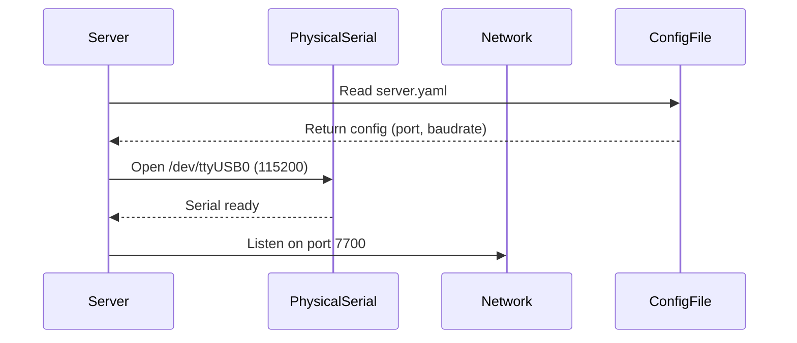
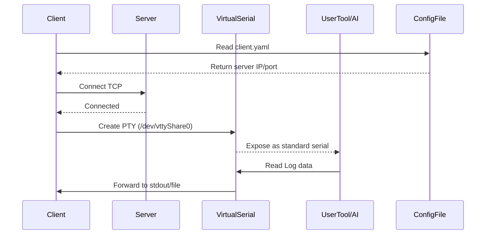
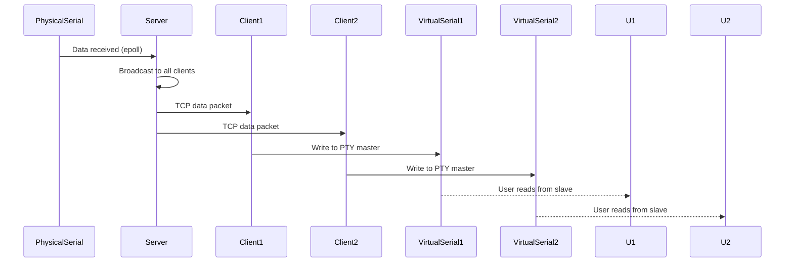
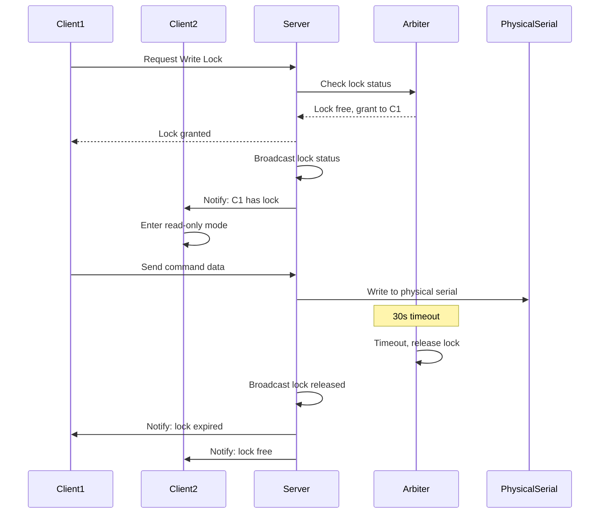
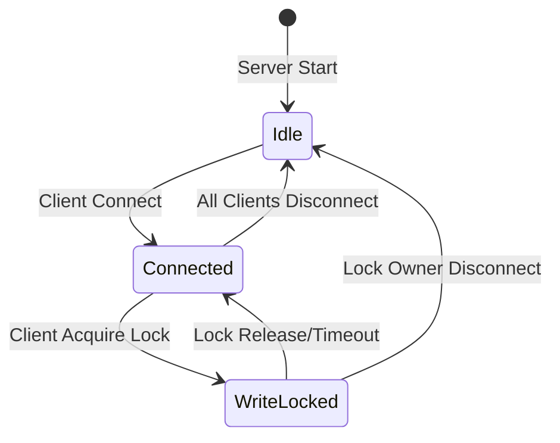
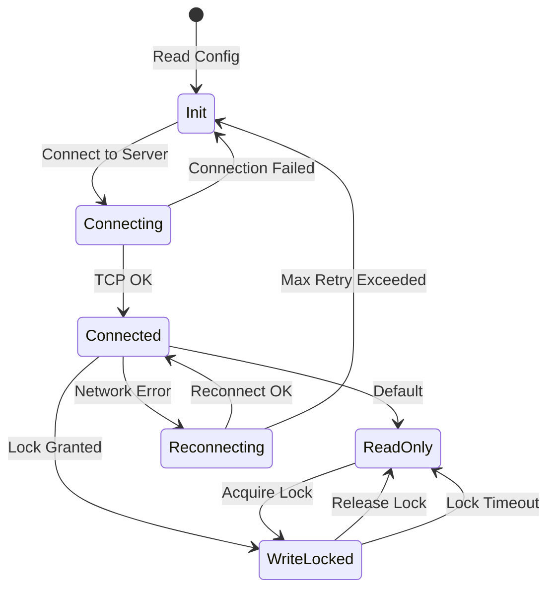
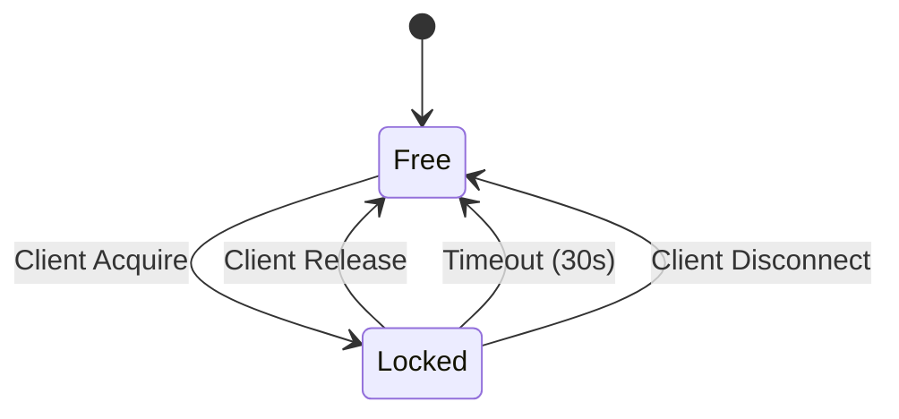
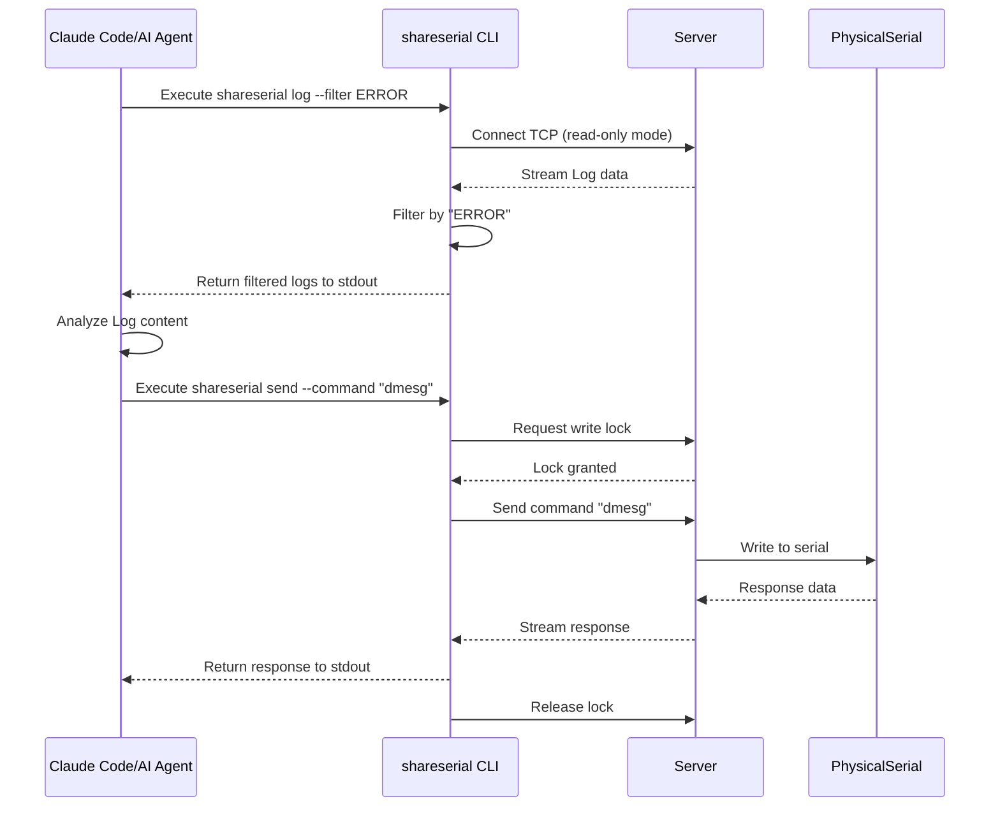
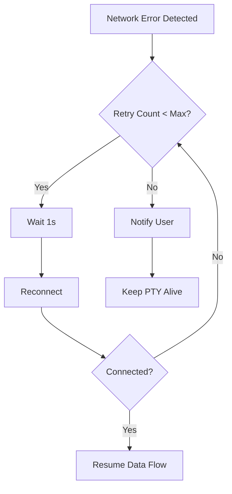
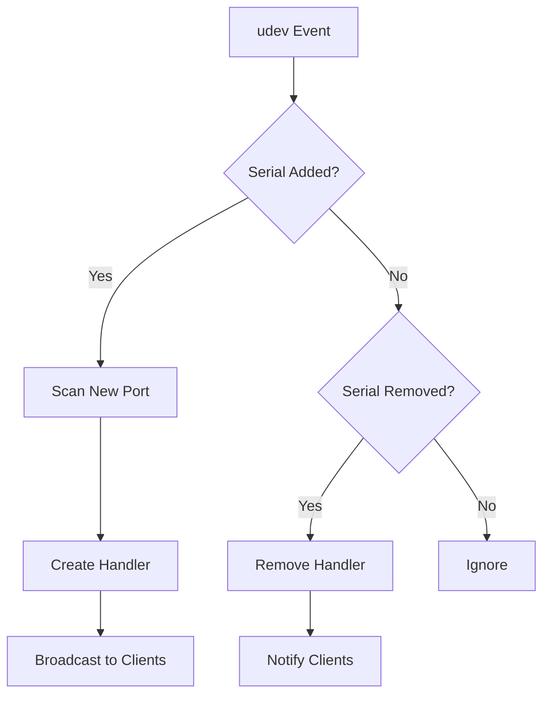

# SYSTEM_FLOW.md - 系统调用流程

## 1. 系统交互时序图（简化版）

### 1.1 服务启动流程



### 1.2 客户端连接流程



### 1.3 数据流转（读取）



### 1.4 写入仲裁流程（独占模式）



## 2. 状态机定义

### 2.1 服务端串口状态



### 2.2 客户端连接状态（简化版）



### 2.3 写锁状态



## 3. AI 调用 CLI 接口流程

### 3.1 CLI 命令设计

```bash
# 获取实时 Log（输出到 stdout）
shareserial log --server 192.168.1.100:7700

# 过滤关键词
shareserial log --server 192.168.1.100:7700 --filter "ERROR|WARN"

# 时间范围
shareserial log --server 192.168.1.100:7700 --since "5m" --until "2m"

# 输出 JSON 格式（便于程序解析）
shareserial log --server 192.168.1.100:7700 --format json

# 获取写锁并发送命令
shareserial send --server 192.168.1.100:7700 --command "reboot"

# 查看连接状态
shareserial status --server 192.168.1.100:7700
```

### 3.2 AI 调用时序图



### 3.3 JSON 输出格式

```json
{
  "timestamp": "2026-05-28T17:30:00Z",
  "level": "ERROR",
  "message": "kernel: Unable to handle kernel NULL pointer dereference",
  "source": "kernel",
  "raw": "[17:30:00] ERROR: kernel: Unable to handle kernel NULL pointer dereference"
}
```

### 3.4 Claude Skill 封装

```yaml
# .claude/skills/shareserial-log.md
name: shareserial-log
description: 获取远程串口 Log 数据，支持过滤和分析
trigger: 用户提到 "查看 Log"、"串口日志"、"分析 Log"

parameters:
  - name: filter
    description: 过滤关键词（正则表达式）
    default: ""
  - name: since
    description: 时间范围起点（如 "5m" 表示最近5分钟）
    default: "1m"
  - name: format
    description: 输出格式（text/json）
    default: "text"

command: shareserial log --server ${SERVER} --filter "${filter}" --since "${since}" --format ${format}
```

**已删除章节：**
- ~~RFC2217 协议交互~~ → 简化为纯数据转发
- ~~mDNS 服务发现~~ → 配置文件替代

## 4. 错误处理流程

### 5.1 网络断开



### 5.2 串口热插拔



---

**Why:** 定义清晰的交互流程和状态机，便于开发和测试
**How to apply:** 开发时遵循时序图，测试用例覆盖所有状态转换